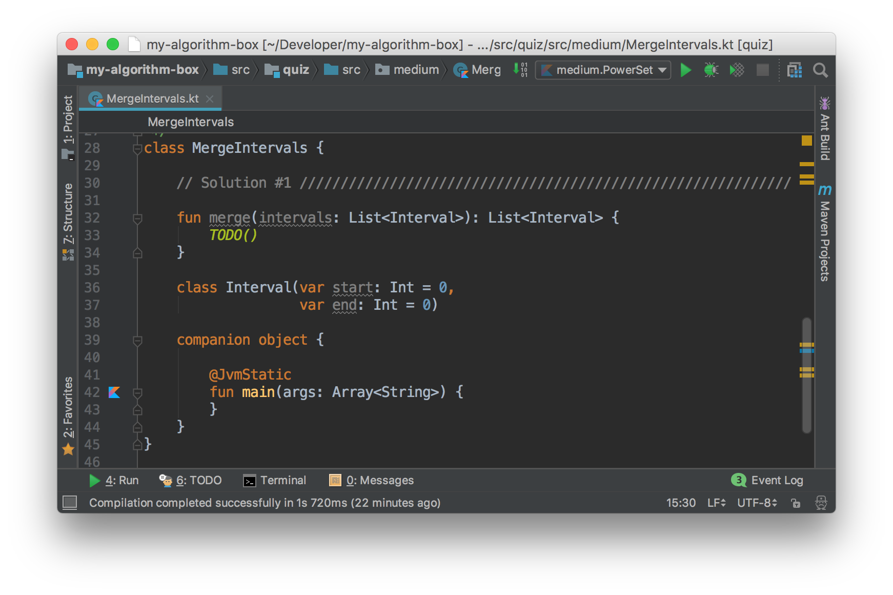

# Welcome

This is a versioned collection of algorithm quizes you might be facing in the interviews.

Setup
---

- Download Jetbrains IntelliJ IDEA, [link](https://www.jetbrains.com/idea/download/#section=mac).

How to run
---

### Kotlin
 
If the code is written in Kotlin, which means it could be compiled to a Java executable, where the static `main` function is the entry to the code.

In the IDE, find the `main` function of the *companion* object, and click the icon  on the left.

